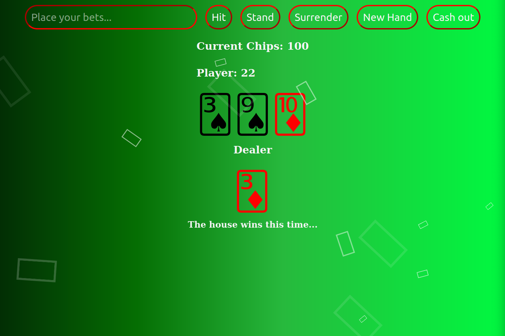

# Title: OOP: Blackjack

- Repository: `php-blackjack`
- Type of Challenge: `Learning challenge`
- Duration: `2 days`
- Team challenge : `solo`
- A first dive into OOP (object oriented programming)



## The Mission
Project to make a game in PHP: Blackjack!
To keep the code structured I have used classes and objects.

### Blackjack Rules
- Cards are between 1-11 points.
    - Faces are worth 10
    - Ace is always worth 11
- Getting more than 21 points, means that you lose.
- To win, you need to have more points than the dealer, but not more than 21.
- The dealer is obligated to keep taking cards until they have at least 15 points.
- We are not playing with blackjack rules on the first turn (having 21 on first turn) - we leave this up to you as a nice to have.

#### Flow
  - A new deck is shuffled
  - Player and dealer get 2 random cards
  - Dealer shows first card he drew to player
  - Player either keeps getting hit (asks for more cards), or stands down.
  - If the player at any point goes above 21, he automatically loses.
  - Once the player is done the dealer keeps taking cards until he has at least 15 points. If he hits above 21 he automatically loses.
  - At the end display the winner

### Instructions
#### Creating the base classes
1. Create a class called `Player` in the file `Player.php`.
1. Add 2 private properties:
    - `cards` (array)
    - `lost` (bool, default = false)
1. Add a couple of empty public methods to this class: 
	- `hit`
	- `surrender`
	- `getScore`
	- `hasLost`
1. Create a class called `Blackjack` in the file `Blackjack.php`
1. Add 3 private properties 
    - `player`
    - `dealer`
    - `deck`
1. Add the following public methods:
    - `getPlayer`
    - `getDealer`
1. In the [constructor](https://www.php.net/manual/en/language.oop5.decon.php) do the following:
    - Instantiate the Player class twice, insert it into the `player` property and a `dealer` property.
    - Create a new [`deck` object](code/Deck.php) (code has already been written for you!).
    - Shuffle the cards with `shuffle` method on deck.
1. In the [constructor](https://www.php.net/manual/en/language.oop5.decon.php) of the `Player` class;
    - Make it require the `Deck` object.
    - Pass this `Deck` from the `Blackjack` constructor.
    - Now draw 2 cards for the player. You have to use existing code for this from the Deck class.
1. Save the instance of the enitre `Blackjack`object in the session (you're gonna need it)
1. Use forms to send to the `index.php` page what the player's action is. (i.e. hit/stand/surrender)
1. Use the class' methods to react to these actions.
    - `hit` should add a card to the player. If this brings him above 21, set `lost` property to `true`.
    - `surrender` should make you surrender the game. (Dealer wins.)
        This sets the property `lost` in the `player` instance to true.
    - `getScore` loops over all the cards and return the total value of that player.
    - `stand` does not have a method in the player class but will instead call hit on the `dealer` instance.
    - `hasLost` will return the bool of the lost property.
    
#### The dealer
So far we are assuming the player and dealer play with the same rules, hence they share a class. There is of course an important difference: the dealer does keep playing with the function `hit` until he has at least 15.

1. To change this behavior, we have are going [extend](https://www.php.net/manual/en/language.oop5.inheritance.php) the `player` class and extend it to a newly created `dealer` class. 

1. Change the `Blackjack` class to create a new `dealer` object instead of a `player` object for the property of the dealer. 

1. Now create a `hit` function that keeps drawing cards until the dealer has at least 15 points. The tricky part is that we also need the `lost` check we already had in the `hit` function of the player. We could just copy the code but duplicated code is never the solution, instead you can use the following code to call the old `hit` function:

```parent::hit();```

1. When you the **hit** button call `hit` on player, then check the lost status of the player. 
1. When you the **stand** button call `hit` on dealer, then check the lost status of the dealer. If he is not lost, compare scores to set the winner (If equal the dealer wins). 
1. **Surrender**: the dealer auto wins.
1. Always display on the page the scores of both players. If you have a winner, display it.
1. End of the game: destroy the current `blackjack` variable so the game restarts.
    
-I have also Implemented a betting system
    - Every new player (new session) starts with 100 chips
    - After the player gets his 2 first cards every round ask how much he wants to bet. He needs to bet at least 5 chips. 
     - If the player wins the bet he gains double the amount of chips.
- Implement the blackjack first turn rule: if the player draws 21 the first turn: he directly wins. If the dealer draws 21 the first turn, he wins. If both draw it, it is a tie. 
    - A blackjack means an auto win of 10 chips, a blackjack of the dealer a loss of 5 chips for the player.
    
